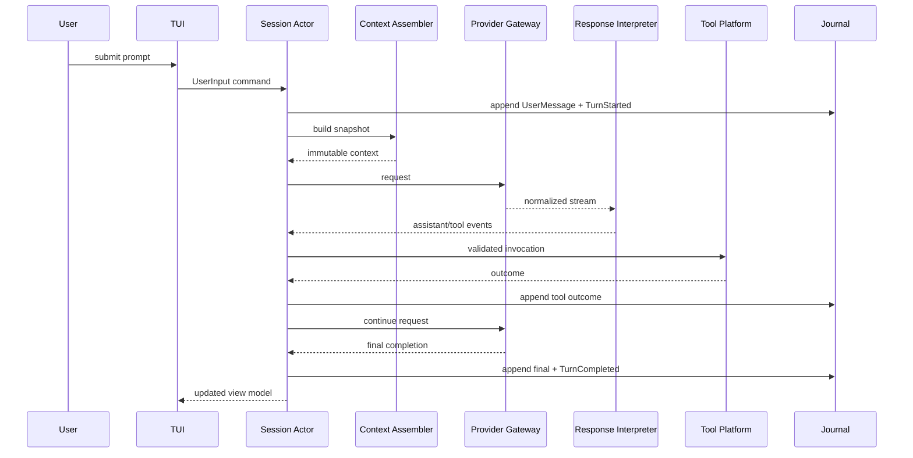
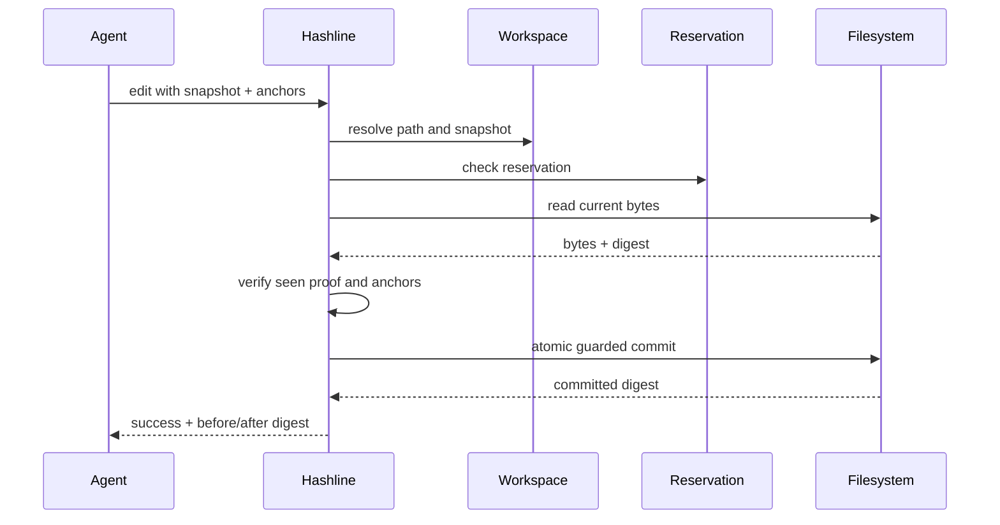
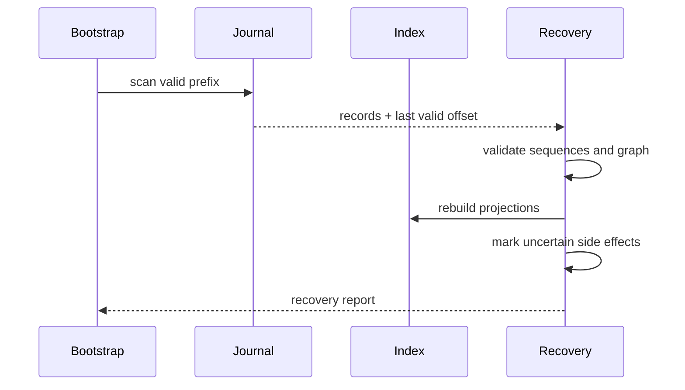
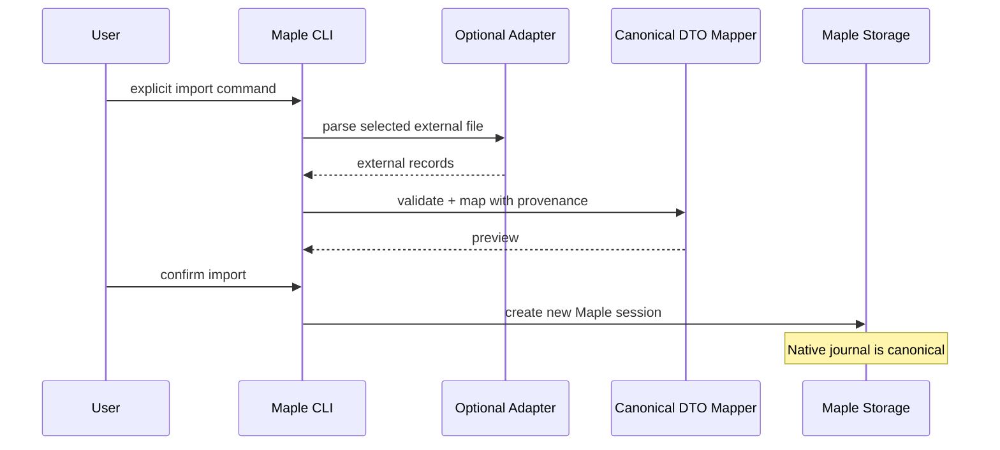

# Appendix A — Sequence Diagrams

## A. Normal user turn

```mermaid
sequenceDiagram
  participant U as User
  participant T as TUI
  participant S as Session Actor
  participant C as Context Assembler
  participant P as Provider Gateway
  participant I as Response Interpreter
  participant X as Tool Platform
  participant J as Journal
  U->>T: submit prompt
  T->>S: UserInput command
  S->>J: append UserMessage + TurnStarted
  S->>C: build snapshot
  C-->>S: immutable context
  S->>P: request
  P-->>I: normalized stream
  I-->>S: assistant/tool events
  S->>X: validated invocation
  X-->>S: outcome
  S->>J: append tool outcome
  S->>P: continue request
  P-->>S: final completion
  S->>J: append final + TurnCompleted
  S-->>T: updated view model
```

## B. Guarded file edit

```mermaid
sequenceDiagram
  participant A as Agent
  participant H as Hashline
  participant W as Workspace
  participant R as Reservation
  participant F as Filesystem
  A->>H: edit with snapshot + anchors
  H->>W: resolve path and snapshot
  H->>R: check reservation
  H->>F: read current bytes
  F-->>H: bytes + digest
  H->>H: verify seen proof and anchors
  H->>F: atomic guarded commit
  F-->>H: committed digest
  H-->>A: success + before/after digest
```

## C. Crash recovery

```mermaid
sequenceDiagram
  participant B as Bootstrap
  participant J as Journal
  participant I as Index
  participant R as Recovery
  B->>J: scan valid prefix
  J-->>R: records + last valid offset
  R->>R: validate sequences and graph
  R->>I: rebuild projections
  R->>R: mark uncertain side effects
  R-->>B: recovery report
```

## D. Optional Pi import

```mermaid
sequenceDiagram
  participant U as User
  participant CLI as Maple CLI
  participant A as Optional Adapter
  participant D as Canonical DTO Mapper
  participant S as Maple Storage
  U->>CLI: explicit import command
  CLI->>A: parse selected external file
  A-->>CLI: external records
  CLI->>D: validate + map with provenance
  D-->>CLI: preview
  U->>CLI: confirm import
  CLI->>S: create new Maple session
  Note over S: Native journal is canonical
```
